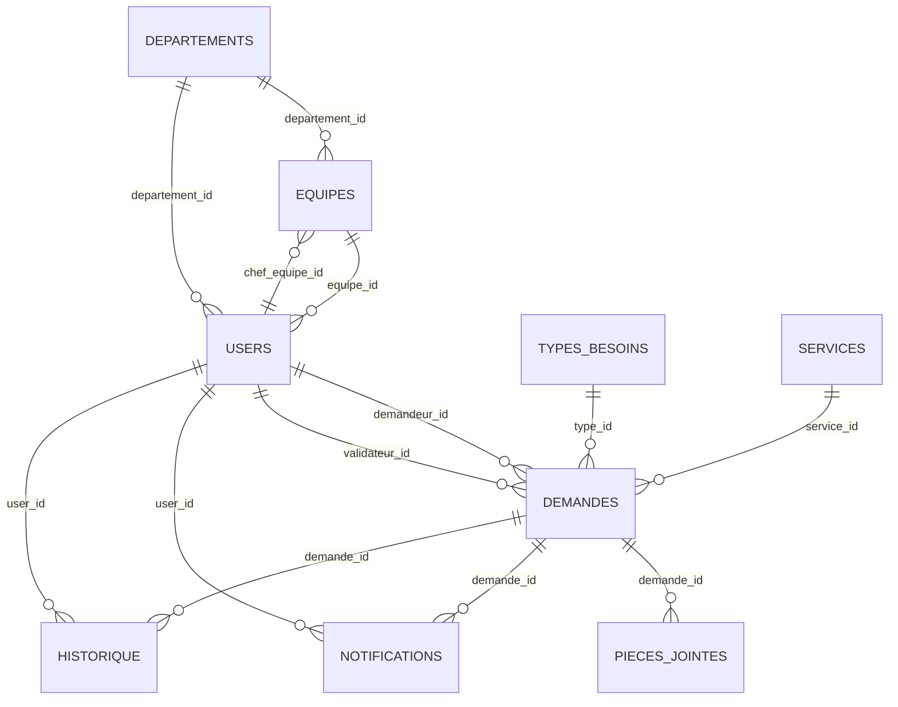
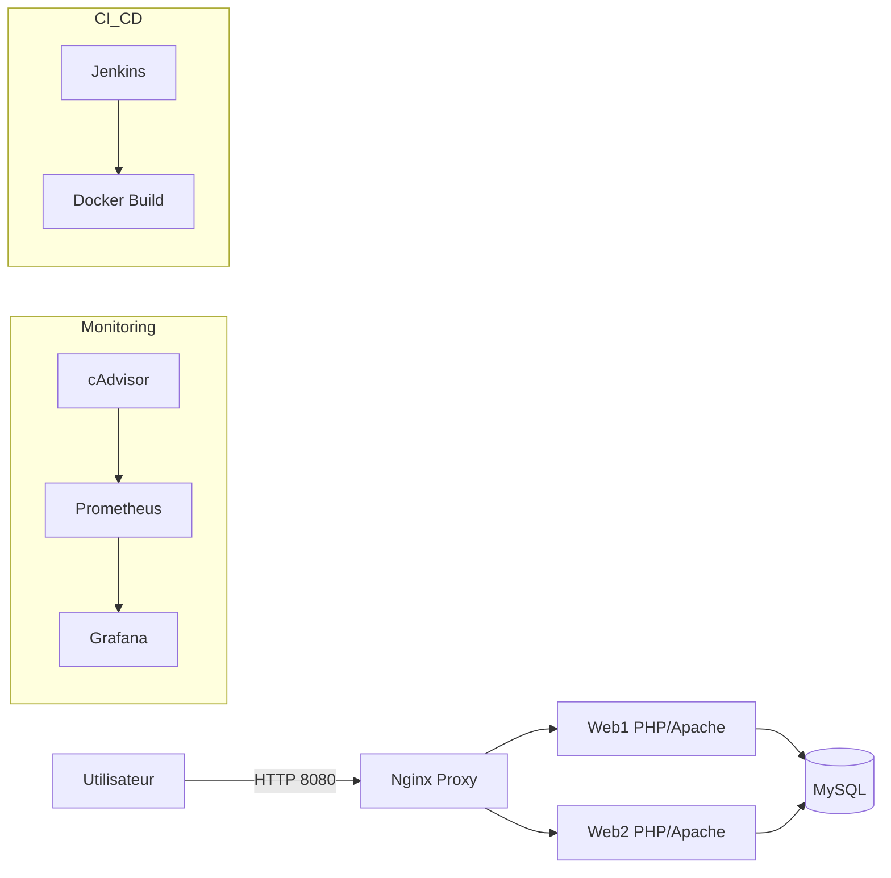
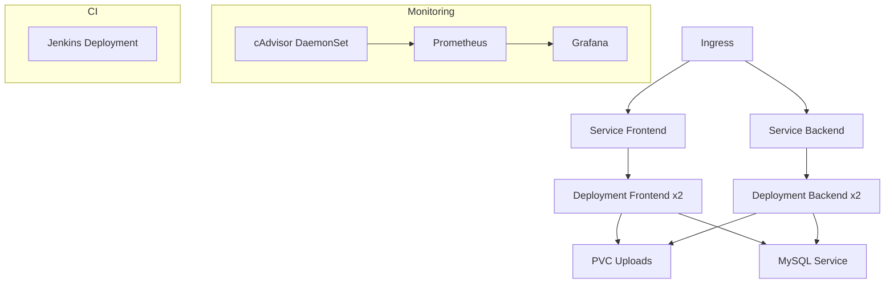
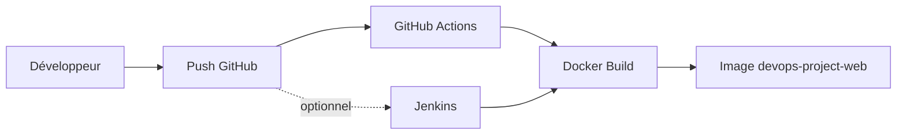

# Rapport complet — Projet de gestion des demandes (DevOps)

Date : 13/05/2026  
Version : 1.0  
Statut : Rapport complet (documentation consolidée)

---

## 1. Résumé exécutif

Le projet **Site_Web** est une application PHP/MySQL permettant la gestion des demandes internes (Demandeur, Validateur, Administrateur). L’architecture technique est conteneurisée (Docker), avec un mode haute disponibilité en local (Nginx + 2 instances web), une stack de monitoring (Prometheus/Grafana/cAdvisor), et des manifestes Kubernetes pour le déploiement en cluster. La CI/CD principale est assurée par **GitHub Actions**, tandis que **Jenkins** est conservé comme pipeline historique.

---

## 2. Contexte, objectifs et périmètre

### 2.1 Contexte

L’organisation souhaite digitaliser le processus de demandes internes afin de réduire les délais, assurer la traçabilité et faciliter le suivi.

### 2.2 Objectifs

- Centraliser la création et la validation des demandes.
- Offrir un suivi clair aux demandeurs.
- Mettre à disposition un espace administrateur pour la gestion globale.

### 2.3 Périmètre fonctionnel

**Inclus** : authentification, gestion des rôles, création/suivi des demandes, validation/rejet, notifications.  
**Exclus** : achats réels (ERP), intégrations externes avancées.

### 2.4 Acteurs

- **Demandeur** (employé)
- **Validateur** (chef d’équipe)
- **Administrateur**

---

## 3. Exigences

### 3.1 Fonctionnelles

- Soumission d’une demande avec description et priorité.
- Historique personnel des demandes.
- Validation/rejet avec commentaire.
- Gestion des utilisateurs et types de besoins.
- Mise à jour des statuts.

### 3.2 Non fonctionnelles

- Temps de réponse < 3 s sur les pages principales.
- Disponibilité cible: 99% (free tier).
- Sauvegardes régulières de la base.
- Confidentialité des données (rôles, sessions).

---

## 4. Architecture fonctionnelle

### 4.1 Modules applicatifs

- **Demandeur** : création, suivi, historique, modification avant validation.
- **Validateur** : consultation, validation/rejet, filtrage.
- **Administrateur** : gestion des utilisateurs, types, demandes, services.
- **Auth** : espace `php-login/`.

### 4.2 Structure du projet (extrait)

| Dossier       | Rôle                     |
| ------------- | ------------------------ |
| `Demander/`   | Front Demandeur          |
| `Validateur/` | Front Validateur         |
| `admin/`      | Administration           |
| `php-login/`  | Authentification         |
| `shared/`     | Configuration partagée   |
| `kubernetes/` | Manifests Kubernetes     |
| `monitoring/` | Stack Prometheus/Grafana |
| `database/`   | Schéma + données seed    |

---

## 5. Architecture technique

### 5.1 Stack

| Composant      | Version               | Rôle                 |
| -------------- | --------------------- | -------------------- |
| PHP            | 8.2                   | Backend applicatif   |
| Apache         | 2.4 (image webdevops) | Serveur web          |
| MySQL          | 8.0                   | Base de données      |
| Docker         | N/A                   | Conteneurisation     |
| Docker Compose | N/A                   | Orchestration locale |
| Nginx          | 1.27                  | Reverse proxy (HA)   |
| Grafana        | 11.2.0                | Dashboards           |
| Prometheus     | 2.54.1                | Collecte métriques   |
| cAdvisor       | 0.49.1                | Métriques conteneurs |
| Jenkins        | LTS JDK17             | CI/CD historique     |
| GitHub Actions | N/A                   | CI/CD principale     |

---

## 6. Base de données

### 6.1 Tables principales

| Table            | Rôle                   |
| ---------------- | ---------------------- |
| `users`          | Utilisateurs et rôles  |
| `demandes`       | Demandes et statuts    |
| `types_besoins`  | Typologie des demandes |
| `services`       | Services métiers       |
| `notifications`  | Notifications          |
| `historique`     | Historique des actions |
| `departements`   | Départements           |
| `equipes`        | Équipes                |
| `pieces_jointes` | Fichiers joints        |
| `brouillons`     | Demandes brouillon     |

### 6.2 Diagramme ER (simplifié)

---

## 7. Docker & Docker Compose

### 7.1 Mode standard (`docker-compose.yml`)

| Service | Port | Rôle                   |
| ------- | ---- | ---------------------- |
| `web`   | 8080 | Application PHP/Apache |
| `db`    | 3306 | MySQL                  |

### 7.2 Mode haute disponibilité (`docker-compose.ha.yml`)

| Service | Port    | Rôle                   |
| ------- | ------- | ---------------------- |
| `web1`  | interne | Instance applicative 1 |
| `web2`  | interne | Instance applicative 2 |
| `proxy` | 8080    | Nginx load balancer    |
| `db`    | interne | MySQL                  |

### 7.3 Monitoring (`docker-compose.monitoring.yml`)

| Service      | Port | Rôle                 |
| ------------ | ---- | -------------------- |
| `prometheus` | 9090 | Collecte métriques   |
| `grafana`    | 3000 | Dashboards           |
| `cadvisor`   | 8082 | Métriques conteneurs |

### 7.4 Jenkins (`docker-compose.jenkins.yml`)

| Service   | Port         | Rôle  |
| --------- | ------------ | ----- |
| `jenkins` | 8081 / 50000 | CI/CD |

### 7.5 Diagramme d’architecture Docker (HA + monitoring + Jenkins)

---

## 8. Kubernetes

### 8.1 Ressources déployées (kustomize)

| Ressource   | Rôle                                                   |
| ----------- | ------------------------------------------------------ |
| Namespace   | Isolation du projet                                    |
| ConfigMap   | Variables non sensibles                                |
| Secret      | Identifiants DB                                        |
| Deployments | Frontend, Backend, MySQL, Grafana, Prometheus, Jenkins |
| Services    | Exposition interne                                     |
| Ingress     | Routage HTTP                                           |
| PVC         | Uploads, MySQL, Grafana, Prometheus, Jenkins           |
| DaemonSet   | cAdvisor                                               |
| HPA/PDB     | Haute disponibilité                                    |

### 8.2 Diagramme Kubernetes (simplifié)

---

## 9. CI/CD

### 9.1 Jenkins (pipeline historique)

| Étape        | Description                                  |
| ------------ | -------------------------------------------- |
| Checkout     | Récupération du code                         |
| Build Docker | Construction de l’image `devops-project-web` |
| Post failure | Log en cas d’échec                           |

### 9.2 GitHub Actions (CI/CD principal)

| Étape        | Description                                  |
| ------------ | -------------------------------------------- |
| Checkout     | Récupération du code                         |
| Build Docker | Construction de l’image `devops-project-web` |

### 9.3 Diagramme de pipeline

---

## 10. Monitoring & observabilité

### 10.1 Stack locale

- **Prometheus** : collecte les métriques.
- **cAdvisor** : expose les métriques Docker.
- **Grafana** : dashboards.

### 10.2 Limites

- L’application PHP ne publie pas de `/metrics` applicatif.
- La supervision MySQL peut être enrichie via un exporter dédié.

---

## 11. Tests & qualité

### 11.1 Tests présents

| Type        | Dossier              |
| ----------- | -------------------- |
| Unitaires   | `tests/Unit/`        |
| Intégration | `tests/Integration/` |
| Smoke       | `tests/Smoke/`       |

### 11.2 Recommandations

- Ajouter des tests automatisés dans GitHub Actions.
- Ajouter un lint PHP (ou PHPStan) avant build.

---

## 12. Sécurité & secrets

- Secrets stockés dans `Secret` Kubernetes ou variables Docker.
- Recommandations : rotation des mots de passe, HTTPS, limitation des droits DB.

---

## 13. Risques & limites

| Risque               | Impact                  | Mitigation                  |
| -------------------- | ----------------------- | --------------------------- |
| MySQL single-replica | Point de panne unique   | DB managée / réplication    |
| Pas de tests CI      | Régressions possibles   | Intégrer tests automatiques |
| Uploads partagés     | Incohérences en HA      | Stockage partagé (S3/NFS)   |
| Monitoring limité    | Observabilité partielle | Exporters applicatifs       |

---

## 14. Roadmap (suggestions)

1. Intégrer tests unitaires & smoke en CI.
2. Ajouter un exporter MySQL + dashboards.
3. Centraliser les secrets (Vault/Secrets Manager).
4. Réplication MySQL ou service managé.
5. Ajouter un stockage d’uploads distribué.

---

## 15. Annexes

### 15.1 Ports locaux

| Service     | URL                                                      |
| ----------- | -------------------------------------------------------- |
| Application | http://localhost:8080/devops-project/php-login/index.php |
| Grafana     | http://localhost:3000                                    |
| Prometheus  | http://localhost:9090                                    |
| cAdvisor    | http://localhost:8082                                    |
| Jenkins     | http://localhost:8081                                    |

### 15.2 Variables d’environnement clés

| Variable       | Usage              |
| -------------- | ------------------ |
| `DB_HOST`      | Host MySQL         |
| `DB_PORT`      | Port MySQL         |
| `DB_NAME`      | Base de données    |
| `DB_USER`      | Compte MySQL       |
| `DB_PASS`      | Mot de passe MySQL |
| `BASE_URL`     | Base URL app       |
| `APP_BASE_URL` | URL publique       |

---

## Conclusion

Le projet répond aux objectifs fonctionnels (gestion des demandes, validation, administration) et met en place une base DevOps cohérente et pédagogique. L’infrastructure est reproductible (Docker), extensible (Kubernetes), et observable (Prometheus/Grafana). La CI/CD est fonctionnelle via GitHub Actions, et Jenkins reste disponible comme historique. Les principaux axes d’amélioration concernent l’automatisation des tests, la résilience de MySQL et l’observabilité applicative.
